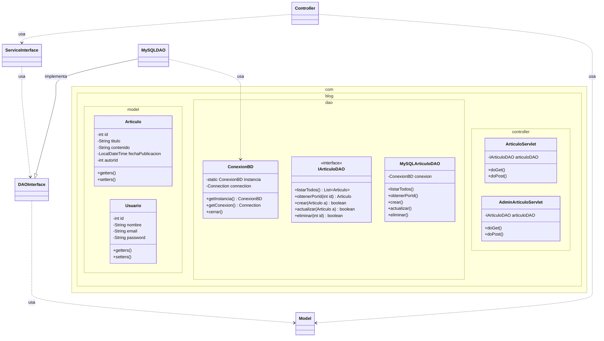

# Diagramas del Proyecto

## Diagrama de Clases (Paquetes Principales)



## Diagrama de Casos de Uso

```mermaid
usecaseDiagram
    actor "Visitante (No Registrado)" as Visitante
    actor "Administrador" as Admin

    package "Blog JavaWeb" {
        usecase "Ver Lista de Artículos" as UC1
        usecase "Leer Artículo Completo" as UC2
        usecase "Iniciar Sesión" as UC3
        usecase "Gestionar Artículos (CRUD)" as UC4
        usecase "Ver Dashboard" as UC5
        usecase "Cerrar Sesión" as UC6
    }

    Visitante --> UC1
    Visitante --> UC2
    Visitante --> UC3

    Admin --> UC1
    Admin --> UC2
    Admin --> UC4
    Admin --> UC5
    Admin --> UC6
    
    %% Herencia de actores
    Admin --|> Visitante
```
