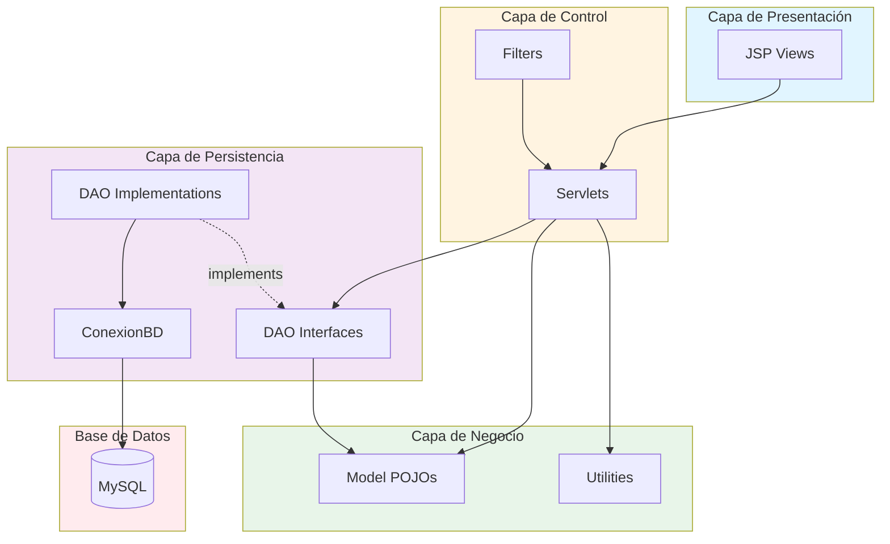
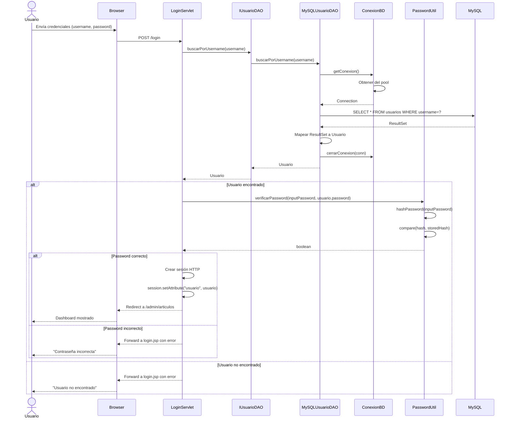
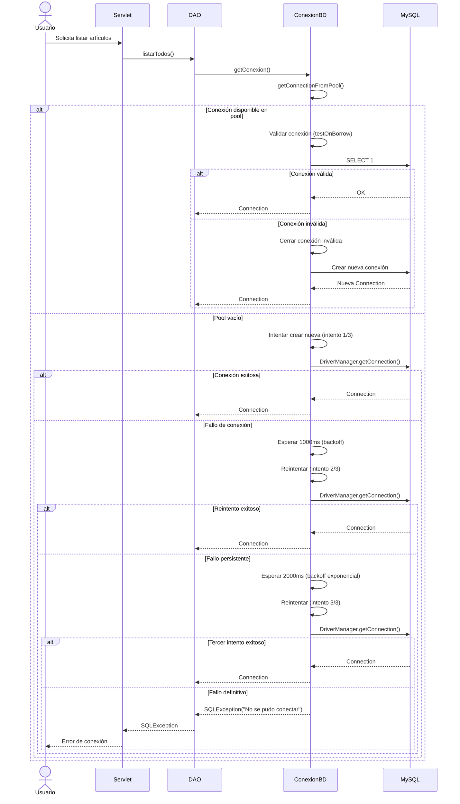
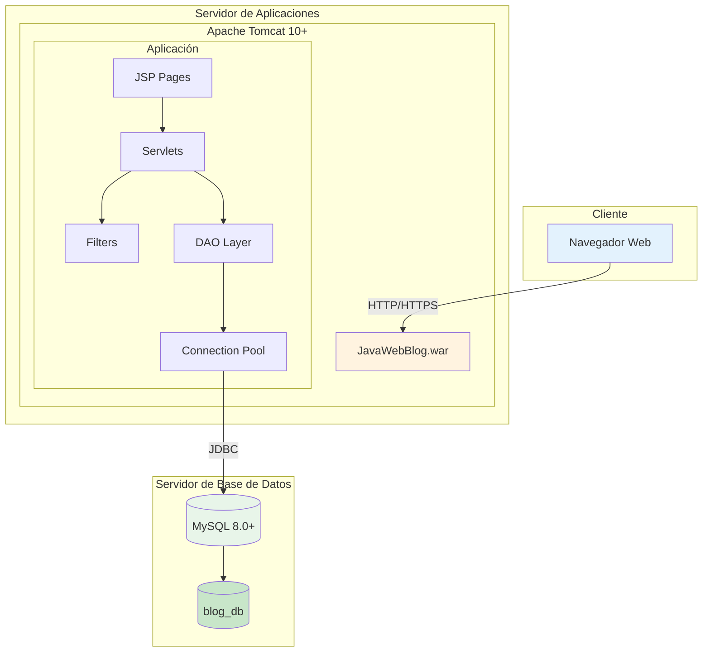
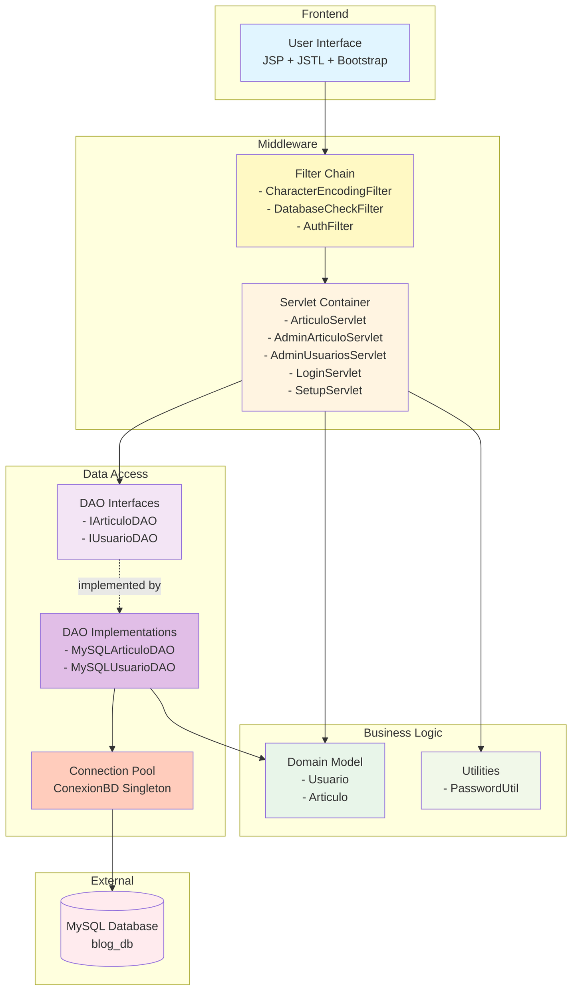

# Diagramas del Proyecto Odally | Blog

Este documento contiene los diagramas UML y de arquitectura del sistema de gestión de contenidos Odally | Blog, desarrollado con JavaWeb (Servlets/JSP) y MySQL.

## 1. Diagrama de Clases Completo

```mermaid
classDiagram
    %% Paquete Model
    namespace com_blog_model {
        class Articulo {
            -int id
            -String titulo
            -String contenido
            -LocalDateTime fechaPublicacion
            -int autorId
            -String autorNombre
            +Articulo()
            +Articulo(int, String, String, LocalDateTime, int)
            +getId() int
            +setId(int)
            +getTitulo() String
            +setTitulo(String)
            +getContenido() String
            +setContenido(String)
            +getFechaPublicacion() LocalDateTime
            +setFechaPublicacion(LocalDateTime)
            +getAutorId() int
            +setAutorId(int)
            +getAutorNombre() String
            +setAutorNombre(String)
            +getFechaPublicacionFormateada() String
        }
        
        class Usuario {
            -int id
            -String nombre
            -String email
            -String username
            -String password
            -String rol
            +Usuario()
            +Usuario(int, String, String, String, String, String)
            +getId() int
            +setId(int)
            +getNombre() String
            +setNombre(String)
            +getEmail() String
            +setEmail(String)
            +getUsername() String
            +setUsername(String)
            +getPassword() String
            +setPassword(String)
            +getRol() String
            +setRol(String)
        }
    }

    %% Paquete DAO Interfaces
    namespace com_blog_dao {
        class IArticuloDAO {
            <<interface>>
            +listarTodos() List~Articulo~
            +obtenerPorId(int) Articulo
            +crear(Articulo) boolean
            +actualizar(Articulo) boolean
            +eliminar(int) boolean
            +contarTotal() int
        }
        
        class IUsuarioDAO {
            <<interface>>
            +buscarPorUsername(String) Usuario
            +obtenerPorId(int) Usuario
            +crear(Usuario) boolean
            +listarTodos() List~Usuario~
            +actualizarRol(int, String) boolean
            +eliminar(int) boolean
            +eliminarTodosExceptoAdmins() int
        }
        
        class MySQLArticuloDAO {
            -ConexionBD conexionBD
            -int MAX_OPERATION_RETRIES
            +MySQLArticuloDAO()
            +listarTodos() List~Articulo~
            +obtenerPorId(int) Articulo
            +crear(Articulo) boolean
            +actualizar(Articulo) boolean
            +eliminar(int) boolean
            +contarTotal() int
            -executeWithRetry(DatabaseOperation, String) T
        }
        
        class MySQLUsuarioDAO {
            -ConexionBD conexionBD
            -int MAX_OPERATION_RETRIES
            +MySQLUsuarioDAO()
            +buscarPorUsername(String) Usuario
            +obtenerPorId(int) Usuario
            +crear(Usuario) boolean
            +listarTodos() List~Usuario~
            +actualizarRol(int, String) boolean
            +eliminar(int) boolean
            +eliminarTodosExceptoAdmins() int
            -executeWithRetry(DatabaseOperation, String) T
        }
        
        class ConexionBD {
            <<Singleton>>
            -static volatile ConexionBD instancia
            -List~PooledConnection~ connectionPool
            -int maxConnections
            -int minConnections
            -int maxRetries
            -long initialRetryDelayMs
            -ConexionBD()
            +static getInstancia() ConexionBD
            +getConexion() Connection
            +cerrarConexion(Connection)
            +shutdown()
            +getPoolStats() String
            +static verificarConexion() boolean
            +static verificarConexionConParametros(String, String, String) boolean
            -initializePool()
            -createNewConnection() Connection
            -getConnectionFromPool() Connection
            -isConnectionValid(Connection) boolean
            -cleanupIdleConnections()
        }
        
        class DatabaseHealthCheck {
            -ConexionBD conexionBD
            +DatabaseHealthCheck()
            +checkDatabaseAvailability() HealthCheckResult
            +checkRequiredTables() HealthCheckResult
            +checkTableStructure(String, String[]) HealthCheckResult
            +performCompleteHealthCheck() HealthCheckResult
            -analyzeConnectionError(SQLException) String
            -tableExists(DatabaseMetaData, String) boolean
        }
        
        class HealthCheckResult {
            -boolean healthy
            -String message
            -List~String~ issues
            +HealthCheckResult(boolean, String)
            +isHealthy() boolean
            +getMessage() String
            +getIssues() List~String~
            +addIssue(String)
        }
    }

    %% Paquete Controller
    namespace com_blog_controller {
        class ArticuloServlet {
            -IArticuloDAO articuloDAO
            +init()
            +doGet(HttpServletRequest, HttpServletResponse)
            +doPost(HttpServletRequest, HttpServletResponse)
            -listarArticulos(HttpServletRequest, HttpServletResponse)
            -verArticulo(HttpServletRequest, HttpServletResponse)
        }
        
        class AdminArticuloServlet {
            -IArticuloDAO articuloDAO
            -IUsuarioDAO usuarioDAO
            +init()
            +doGet(HttpServletRequest, HttpServletResponse)
            +doPost(HttpServletRequest, HttpServletResponse)
            -mostrarDashboard(HttpServletRequest, HttpServletResponse)
            -listarArticulos(HttpServletRequest, HttpServletResponse)
            -mostrarFormularioCrear(HttpServletRequest, HttpServletResponse)
            -mostrarFormularioEditar(HttpServletRequest, HttpServletResponse)
            -crearArticulo(HttpServletRequest, HttpServletResponse)
            -actualizarArticulo(HttpServletRequest, HttpServletResponse)
            -eliminarArticulo(HttpServletRequest, HttpServletResponse)
        }
        
        class AdminUsuariosServlet {
            -IUsuarioDAO usuarioDAO
            +init()
            +doGet(HttpServletRequest, HttpServletResponse)
            +doPost(HttpServletRequest, HttpServletResponse)
            -listarUsuarios(HttpServletRequest, HttpServletResponse)
            -cambiarRol(HttpServletRequest, HttpServletResponse)
            -eliminarUsuario(HttpServletRequest, HttpServletResponse)
            -eliminarTodosAutores(HttpServletRequest, HttpServletResponse)
        }
        
        class LoginServlet {
            -IUsuarioDAO usuarioDAO
            +init()
            +doGet(HttpServletRequest, HttpServletResponse)
            +doPost(HttpServletRequest, HttpServletResponse)
        }
        
        class LogoutServlet {
            +doGet(HttpServletRequest, HttpServletResponse)
            +doPost(HttpServletRequest, HttpServletResponse)
        }
        
        class RegisterServlet {
            -IUsuarioDAO usuarioDAO
            +init()
            +doGet(HttpServletRequest, HttpServletResponse)
            +doPost(HttpServletRequest, HttpServletResponse)
        }
        
        class SetupServlet {
            +doGet(HttpServletRequest, HttpServletResponse)
            +doPost(HttpServletRequest, HttpServletResponse)
            -probarConexion(HttpServletRequest, HttpServletResponse)
            -guardarConfiguracion(HttpServletRequest, HttpServletResponse)
        }
    }

    %% Paquete Filter
    namespace com_blog_filter {
        class AuthFilter {
            +init(FilterConfig)
            +doFilter(ServletRequest, ServletResponse, FilterChain)
            +destroy()
        }
        
        class CharacterEncodingFilter {
            -String encoding
            +init(FilterConfig)
            +doFilter(ServletRequest, ServletResponse, FilterChain)
            +destroy()
        }
        
        class DatabaseCheckFilter {
            -static String SETUP_PATH
            -static Boolean databaseAvailable
            -static long lastCheck
            -static long CHECK_INTERVAL_MS
            +init(FilterConfig)
            +doFilter(ServletRequest, ServletResponse, FilterChain)
            +destroy()
            -shouldSkipCheck(String) boolean
            -isDatabaseAvailable() boolean
            +static invalidateCache()
        }
    }

    %% Paquete Util
    namespace com_blog_util {
        class PasswordUtil {
            <<utility>>
            +static hashPassword(String) String
            +static verificarPassword(String, String) boolean
        }
    }

    %% Relaciones entre clases
    MySQLArticuloDAO ..|> IArticuloDAO : implements
    MySQLUsuarioDAO ..|> IUsuarioDAO : implements
    
    MySQLArticuloDAO --> ConexionBD : uses
    MySQLUsuarioDAO --> ConexionBD : uses
    DatabaseHealthCheck --> ConexionBD : uses
    
    IArticuloDAO --> Articulo : uses
    IUsuarioDAO --> Usuario : uses
    
    ArticuloServlet --> IArticuloDAO : uses
    AdminArticuloServlet --> IArticuloDAO : uses
    AdminArticuloServlet --> IUsuarioDAO : uses
    AdminUsuariosServlet --> IUsuarioDAO : uses
    LoginServlet --> IUsuarioDAO : uses
    LoginServlet --> PasswordUtil : uses
    RegisterServlet --> IUsuarioDAO : uses
    RegisterServlet --> PasswordUtil : uses
    
    DatabaseCheckFilter --> ConexionBD : uses
    
    DatabaseHealthCheck ..> HealthCheckResult : creates
```



## 2. Diagrama de Paquetes



## 3. Diagrama de Casos de Uso

```mermaid
graph LR
    subgraph Sistema["Sistema Odally | Blog"]
        UC1[Ver Lista de Artículos]
        UC2[Leer Artículo Completo]
        UC3[Registrarse]
        UC4[Iniciar Sesión]
        UC5[Cerrar Sesión]
        UC6[Crear Artículo]
        UC7[Editar Artículo]
        UC8[Eliminar Artículo]
        UC9[Ver Dashboard]
        UC10[Gestionar Usuarios]
        UC11[Cambiar Rol Usuario]
        UC12[Eliminar Usuario]
        UC13[Configurar Base de Datos]
    end
    
    Visitante([Visitante])
    Autor([Usuario Autor])
    Admin([Administrador])
    
    Visitante --> UC1
    Visitante --> UC2
    Visitante --> UC3
    Visitante --> UC4
    
    Autor --> UC1
    Autor --> UC2
    Autor --> UC4
    Autor --> UC5
    Autor --> UC6
    Autor --> UC7
    Autor --> UC8
    Autor --> UC9
    
    Admin --> UC1
    Admin --> UC2
    Admin --> UC4
    Admin --> UC5
    Admin --> UC6
    Admin --> UC7
    Admin --> UC8
    Admin --> UC9
    Admin --> UC10
    Admin --> UC11
    Admin --> UC12
    Admin --> UC13
    
    UC10 ..> UC11 : includes
    UC10 ..> UC12 : includes
```

## 4. Diagrama de Secuencia: Autenticación de Usuario



## 5. Diagrama de Secuencia: Reconexión Automática a BD



## 6. Diagrama de Despliegue



## 7. Diagrama de Componentes



## Notas sobre los Diagramas

### Principios Aplicados

1. **Separación de Responsabilidades (SoC):** Cada capa tiene responsabilidades bien definidas
2. **Inversión de Dependencias (DIP):** Los controladores dependen de interfaces DAO, no de implementaciones
3. **Patrón MVC:** Clara separación entre Modelo, Vista y Controlador
4. **Patrón DAO:** Capa de abstracción para acceso a datos
5. **Patrón Singleton:** ConexionBD garantiza una única instancia del pool

### Flujo de Datos

1. **Petición:** Usuario → Browser → Filters → Servlet
2. **Procesamiento:** Servlet → DAO Interface → DAO Implementation → Connection Pool → MySQL
3. **Respuesta:** MySQL → DAO → Servlet → JSP → Browser → Usuario

### Seguridad

- **AuthFilter:** Protege rutas administrativas
- **DatabaseCheckFilter:** Verifica disponibilidad de BD antes de procesar peticiones
- **PreparedStatements:** Previene SQL Injection
- **PasswordUtil:** Hasheo de contraseñas con SHA-256

---

**Proyecto:** Odally | Blog  
**Equipo:** Dylan David Silva Orrego, Maria Alejandra Munevar Barrera  
**Profesora:** Lilia Marcela Espinosa Rodríguez  
**Universidad Distrital Francisco José de Caldas - 2025**

