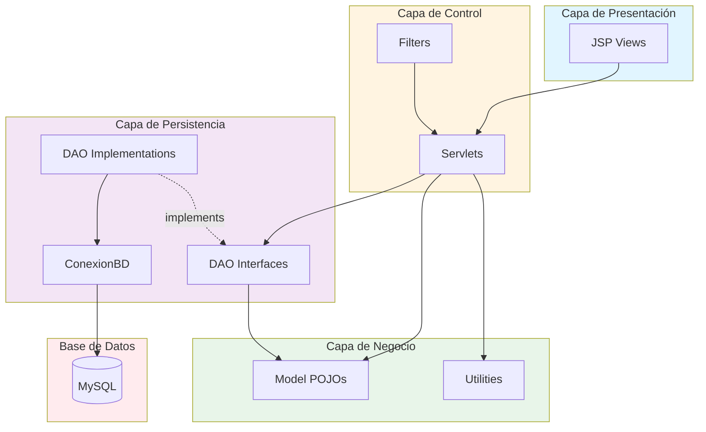

# Diagramas del Proyecto Odally | Blog

Este documento contiene los diagramas UML y de arquitectura del sistema de gestión de contenidos Odally | Blog, desarrollado con JavaWeb (Servlets/JSP) y MySQL.

## 1. Diagrama de Clases Completo

```mermaid
classDiagram
    %% Paquete Model
    namespace com_blog_model {
        class Articulo {
            -int id
            -String titulo
            -String contenido
            -LocalDateTime fechaPublicacion
            -int autorId
            -String autorNombre
            +Articulo()
            +Articulo(int, String, String, LocalDateTime, int)
            +getId() int
            +setId(int)
            +getTitulo() String
            +setTitulo(String)
            +getContenido() String
            +setContenido(String)
            +getFechaPublicacion() LocalDateTime
            +setFechaPublicacion(LocalDateTime)
            +getAutorId() int
            +setAutorId(int)
            +getAutorNombre() String
            +setAutorNombre(String)
            +getFechaPublicacionFormateada() String
        }
        
        class Usuario {
            -int id
            -String nombre
            -String email
            -String username
            -String password
            -String rol
            +Usuario()
            +Usuario(int, String, String, String, String, String)
            +getId() int
            +setId(int)
            +getNombre() String
            +setNombre(String)
            +getEmail() String
            +setEmail(String)
            +getUsername() String
            +setUsername(String)
            +getPassword() String
            +setPassword(String)
            +getRol() String
            +setRol(String)
        }
    }

    %% Paquete DAO Interfaces
    namespace com_blog_dao {
        class IArticuloDAO {
            <<interface>>
            +listarTodos() List~Articulo~
            +obtenerPorId(int) Articulo
            +crear(Articulo) boolean
            +actualizar(Articulo) boolean
            +eliminar(int) boolean
            +contarTotal() int
        }
        
        class IUsuarioDAO {
            <<interface>>
            +buscarPorUsername(String) Usuario
            +obtenerPorId(int) Usuario
            +crear(Usuario) boolean
            +listarTodos() List~Usuario~
            +actualizarRol(int, String) boolean
            +eliminar(int) boolean
            +eliminarTodosExceptoAdmins() int
        }
        
        class MySQLArticuloDAO {
            -ConexionBD conexionBD
            -int MAX_OPERATION_RETRIES
            +MySQLArticuloDAO()
            +listarTodos() List~Articulo~
            +obtenerPorId(int) Articulo
            +crear(Articulo) boolean
            +actualizar(Articulo) boolean
            +eliminar(int) boolean
            +contarTotal() int
            -executeWithRetry(DatabaseOperation, String) T
        }
        
        class MySQLUsuarioDAO {
            -ConexionBD conexionBD
            -int MAX_OPERATION_RETRIES
            +MySQLUsuarioDAO()
            +buscarPorUsername(String) Usuario
            +obtenerPorId(int) Usuario
            +crear(Usuario) boolean
            +listarTodos() List~Usuario~
            +actualizarRol(int, String) boolean
            +eliminar(int) boolean
            +eliminarTodosExceptoAdmins() int
            -executeWithRetry(DatabaseOperation, String) T
        }
        
        class ConexionBD {
            <<Singleton>>
            -static volatile ConexionBD instancia
            -List~PooledConnection~ connectionPool
            -int maxConnections
            -int minConnections
            -int maxRetries
            -long initialRetryDelayMs
            -ConexionBD()
            +static getInstancia() ConexionBD
            +getConexion() Connection
            +cerrarConexion(Connection)
            +shutdown()
            +getPoolStats() String
            +static verificarConexion() boolean
            +static verificarConexionConParametros(String, String, String) boolean
            -initializePool()
            -createNewConnection() Connection
            -getConnectionFromPool() Connection
            -isConnectionValid(Connection) boolean
            -cleanupIdleConnections()
        }
        
        class DatabaseHealthCheck {
            -ConexionBD conexionBD
            +DatabaseHealthCheck()
            +checkDatabaseAvailability() HealthCheckResult
            +checkRequiredTables() HealthCheckResult
            +checkTableStructure(String, String[]) HealthCheckResult
            +performCompleteHealthCheck() HealthCheckResult
            -analyzeConnectionError(SQLException) String
            -tableExists(DatabaseMetaData, String) boolean
        }
        
        class HealthCheckResult {
            -boolean healthy
            -String message
            -List~String~ issues
            +HealthCheckResult(boolean, String)
            +isHealthy() boolean
            +getMessage() String
            +getIssues() List~String~
            +addIssue(String)
        }
    }

    %% Paquete Controller
    namespace com_blog_controller {
        class ArticuloServlet {
            -IArticuloDAO articuloDAO
            +init()
            +doGet(HttpServletRequest, HttpServletResponse)
            +doPost(HttpServletRequest, HttpServletResponse)
            -listarArticulos(HttpServletRequest, HttpServletResponse)
            -verArticulo(HttpServletRequest, HttpServletResponse)
        }
        
        class AdminArticuloServlet {
            -IArticuloDAO articuloDAO
            -IUsuarioDAO usuarioDAO
            +init()
            +doGet(HttpServletRequest, HttpServletResponse)
            +doPost(HttpServletRequest, HttpServletResponse)
            -mostrarDashboard(HttpServletRequest, HttpServletResponse)
            -listarArticulos(HttpServletRequest, HttpServletResponse)
            -mostrarFormularioCrear(HttpServletRequest, HttpServletResponse)
            -mostrarFormularioEditar(HttpServletRequest, HttpServletResponse)
            -crearArticulo(HttpServletRequest, HttpServletResponse)
            -actualizarArticulo(HttpServletRequest, HttpServletResponse)
            -eliminarArticulo(HttpServletRequest, HttpServletResponse)
        }
        
        class AdminUsuariosServlet {
            -IUsuarioDAO usuarioDAO
            +init()
            +doGet(HttpServletRequest, HttpServletResponse)
            +doPost(HttpServletRequest, HttpServletResponse)
            -listarUsuarios(HttpServletRequest, HttpServletResponse)
            -cambiarRol(HttpServletRequest, HttpServletResponse)
            -eliminarUsuario(HttpServletRequest, HttpServletResponse)
            -eliminarTodosAutores(HttpServletRequest, HttpServletResponse)
        }
        
        class LoginServlet {
            -IUsuarioDAO usuarioDAO
            +init()
            +doGet(HttpServletRequest, HttpServletResponse)
            +doPost(HttpServletRequest, HttpServletResponse)
        }
        
        class LogoutServlet {
            +doGet(HttpServletRequest, HttpServletResponse)
            +doPost(HttpServletRequest, HttpServletResponse)
        }
        
        class RegisterServlet {
            -IUsuarioDAO usuarioDAO
            +init()
            +doGet(HttpServletRequest, HttpServletResponse)
            +doPost(HttpServletRequest, HttpServletResponse)
        }
        
        class SetupServlet {
            +doGet(HttpServletRequest, HttpServletResponse)
            +doPost(HttpServletRequest, HttpServletResponse)
            -probarConexion(HttpServletRequest, HttpServletResponse)
            -guardarConfiguracion(HttpServletRequest, HttpServletResponse)
        }
    }

    %% Paquete Filter
    namespace com_blog_filter {
        class AuthFilter {
            +init(FilterConfig)
            +doFilter(ServletRequest, ServletResponse, FilterChain)
            +destroy()
        }
        
        class CharacterEncodingFilter {
            -String encoding
            +init(FilterConfig)
            +doFilter(ServletRequest, ServletResponse, FilterChain)
            +destroy()
        }
        
        class DatabaseCheckFilter {
            -static String SETUP_PATH
            -static Boolean databaseAvailable
            -static long lastCheck
            -static long CHECK_INTERVAL_MS
            +init(FilterConfig)
            +doFilter(ServletRequest, ServletResponse, FilterChain)
            +destroy()
            -shouldSkipCheck(String) boolean
            -isDatabaseAvailable() boolean
            +static invalidateCache()
        }
    }

    %% Paquete Util
    namespace com_blog_util {
        class PasswordUtil {
            <<utility>>
            +static hashPassword(String) String
            +static verificarPassword(String, String) boolean
        }
    }

    %% Relaciones entre clases
    MySQLArticuloDAO ..|> IArticuloDAO : implements
    MySQLUsuarioDAO ..|> IUsuarioDAO : implements
    
    MySQLArticuloDAO --> ConexionBD : uses
    MySQLUsuarioDAO --> ConexionBD : uses
    DatabaseHealthCheck --> ConexionBD : uses
    
    IArticuloDAO --> Articulo : uses
    IUsuarioDAO --> Usuario : uses
    
    ArticuloServlet --> IArticuloDAO : uses
    AdminArticuloServlet --> IArticuloDAO : uses
    AdminArticuloServlet --> IUsuarioDAO : uses
    AdminUsuariosServlet --> IUsuarioDAO : uses
    LoginServlet --> IUsuarioDAO : uses
    LoginServlet --> PasswordUtil : uses
    RegisterServlet --> IUsuarioDAO : uses
    RegisterServlet --> PasswordUtil : uses
    
    DatabaseCheckFilter --> ConexionBD : uses
    
    DatabaseHealthCheck ..> HealthCheckResult : creates
```



## 2. Diagrama de Paquetes



## 3. Diagrama de Casos de Uso

```
@startuml
left to right direction

actor Visitante
actor "Usuario Autor" as Autor
actor Administrador

rectangle "Sistema Odally | Blog" {
  usecase "Ver Lista de Artículos" as UC1
  usecase "Leer Artículo Completo" as UC2
  usecase "Registrarse" as UC3
  usecase "Iniciar Sesión" as UC4
  usecase "Cerrar Sesión" as UC5
  usecase "Crear Artículo" as UC6
  usecase "Editar Artículo" as UC7
  usecase "Eliminar Artículo" as UC8
  usecase "Ver Dashboard" as UC9
  usecase "Gestionar Usuarios" as UC10
  usecase "Cambiar Rol Usuario" as UC11
  usecase "Eliminar Usuario" as UC12
  usecase "Configurar Base de Datos" as UC13
  
  UC10 ..> UC11 : includes
  UC10 ..> UC12 : includes
}

Visitante --> UC1
Visitante --> UC2
Visitante --> UC3
Visitante --> UC4

Autor --> UC1
Autor --> UC2
Autor --> UC4
Autor --> UC5
Autor --> UC6
Autor --> UC7
Autor --> UC8
Autor --> UC9

Administrador --> UC1
Administrador --> UC2
Administrador --> UC4
Administrador --> UC5
Administrador --> UC6
Administrador --> UC7
Administrador --> UC8
Administrador --> UC9
Administrador --> UC10
Administrador --> UC11
Administrador --> UC12
Administrador --> UC13
@enduml
```

## Notas sobre los Diagramas

### Principios Aplicados

1. **Separación de Responsabilidades (SoC):** Cada capa tiene responsabilidades bien definidas
2. **Inversión de Dependencias (DIP):** Los controladores dependen de interfaces DAO, no de implementaciones
3. **Patrón MVC:** Clara separación entre Modelo, Vista y Controlador
4. **Patrón DAO:** Capa de abstracción para acceso a datos
5. **Patrón Singleton:** ConexionBD garantiza una única instancia del pool

### Flujo de Datos

1. **Petición:** Usuario → Browser → Filters → Servlet
2. **Procesamiento:** Servlet → DAO Interface → DAO Implementation → Connection Pool → MySQL
3. **Respuesta:** MySQL → DAO → Servlet → JSP → Browser → Usuario

### Seguridad

- **AuthFilter:** Protege rutas administrativas
- **DatabaseCheckFilter:** Verifica disponibilidad de BD antes de procesar peticiones
- **PreparedStatements:** Previene SQL Injection
- **PasswordUtil:** Hasheo de contraseñas con SHA-256

---

**Proyecto:** Odally | Blog  
**Equipo:** Dylan David Silva Orrego, Maria Alejandra Munevar Barrera, Sergio Leonardo Moreno Granado
**Profesora:** Lilia Marcela Espinosa Rodríguez  
**Universidad Distrital Francisco José de Caldas - 2025**

